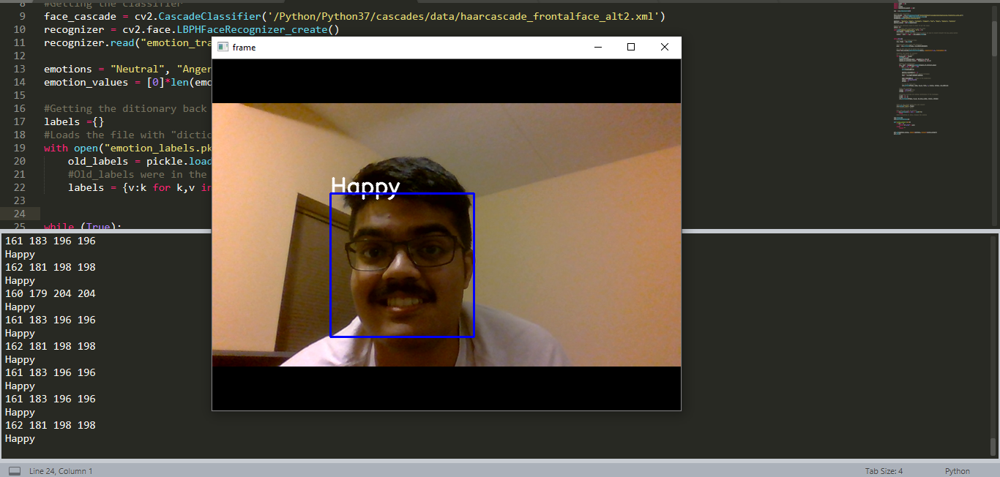

# Expression-Detection
Going through the Cohn-Kanade facial expression dataset to assemble the training and testing data.
A flask app  was also made, but since WSL in Python Anywhere does not support hardware access, it is unable to host
the app. The same issue occured on Heroku. HEnce, the Flask app approach will be abandoned for Streamlit.

Here are the results from the detection:

